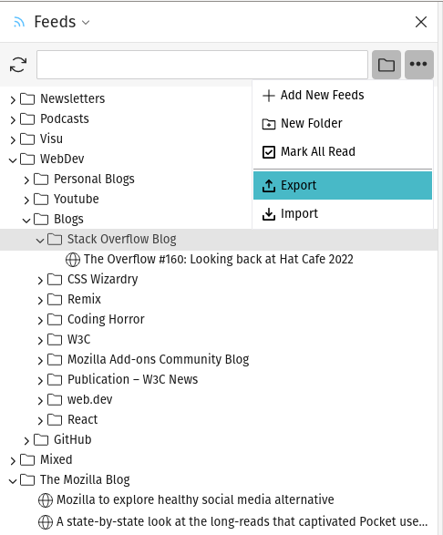

# Feeds Sidebar

A Firefox Extension for managing Web Feeds in the Sidebar.

The goal of this project is to provide a consistent way of following web content and display it in the Sidebar with a similar look and feel to the Bookmarks.

## State of the project
This project is under development and not fully functional. However, in its current state, I consider it "good enough" for my personal use.

If you want to try it you can download the latest working version as `.xpi` file in the [Releases Section](https://github.com/dermeck/feeds-sidebar/releases/tag/v0.22) of this repo or run the [development version](./doc/dev.md).

### Current features include:
- adding feeds manually by entering the URL or importing a set of feeds from an OPML file
- supported feed formats: ATOM, RSS 1.0, RSS 2.0
- list feeds in the sidebar and organize them into folders with drag & drop
- update feeds automatically (and display the number of new items above the toolbar icon)
- export feeds to an OPML file

*It should also respect the users' color settings by using the colors of the theme or operating system and supporting dark mode. However, right now, this is not heavily tested across different environments (mainly in GNOME / Pop Shell) - feedback on this is always welcome!  :)*

### Planned features include:
- detecting feeds in a web page
- synchronization across browser instances (optional)
- various UI improvements

### UI (v0.22.0)

