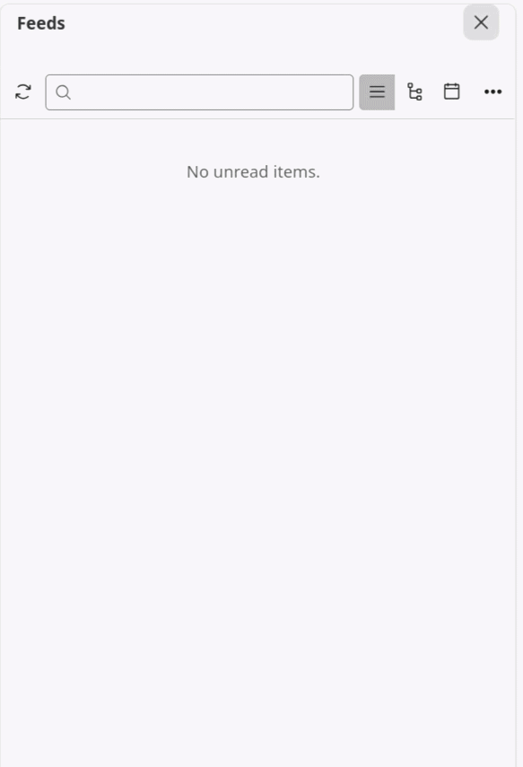
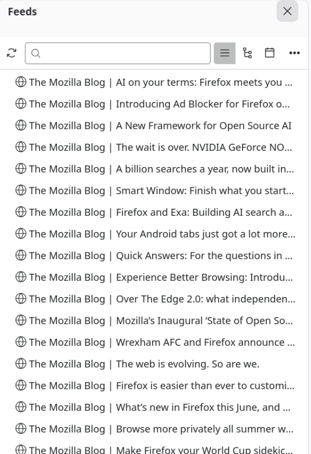
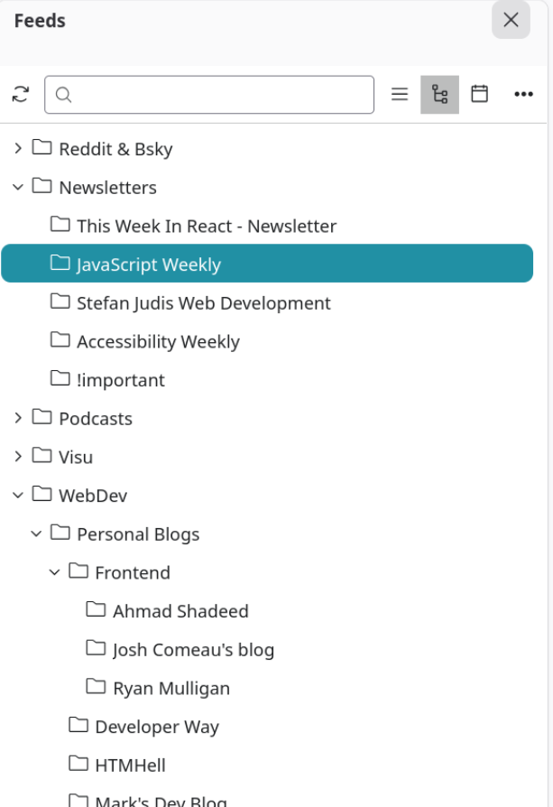
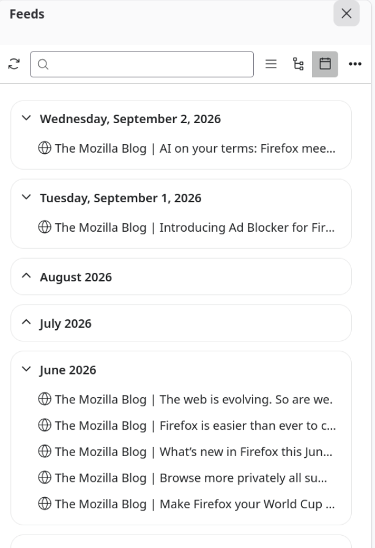
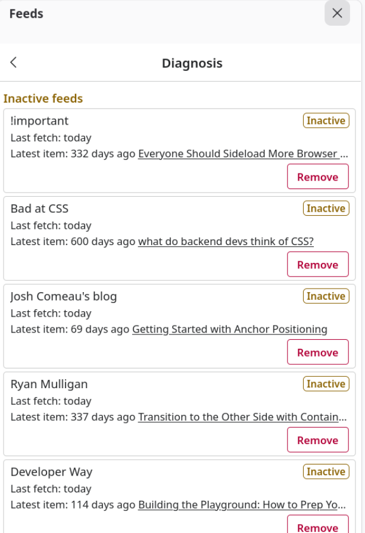
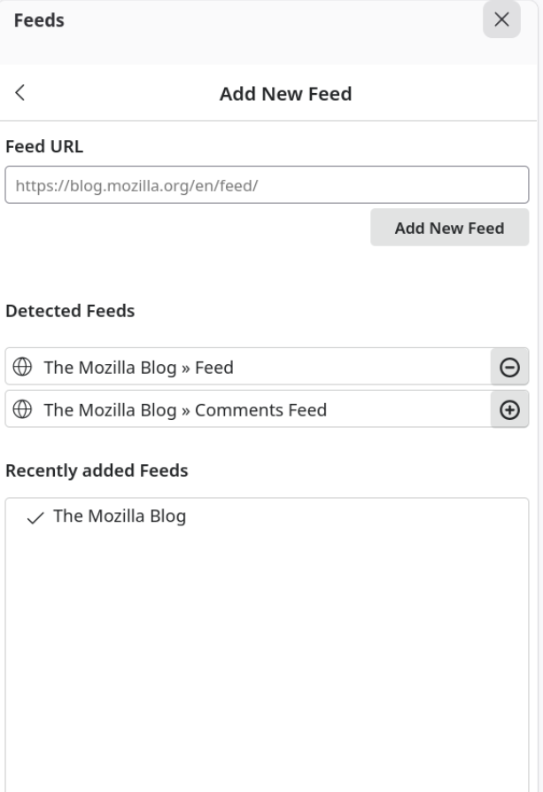

# Feeds Sidebar

A Firefox Extension for managing Web Feeds in the Sidebar.

The goal of this project is to provide a consistent way of following web content and display it in the Sidebar with a similar look and feel to the Bookmarks.

## State of the project
This project is under development. However, in its current state, I consider it "good enough" for my personal use.

If you want to try it you can download it here: https://addons.mozilla.org/en-US/firefox/addon/feeds-sidebar/, get the latest dev version `.xpi` file from the [Releases Section](https://github.com/dermeck/feeds-sidebar/releases) of this repo or build a [development version](./doc/dev.md).

### Current features include:
- subscribe to detected feeds or add them manually by entering the URL
- supported feed formats: ATOM, RSS 1.0, RSS 2.0
- list feeds in the sidebar (plain or grouped by date) and organize them into folders with drag & drop
- update feeds automatically (and display the number of new items above the toolbar icon)
- import and export of OPML files

*It should also respect the users' color settings by using the colors of the theme or operating system and supporting dark mode. However, right now, this is not heavily tested across different environments.*

### UI (v0.60.0)

Show screenshots

