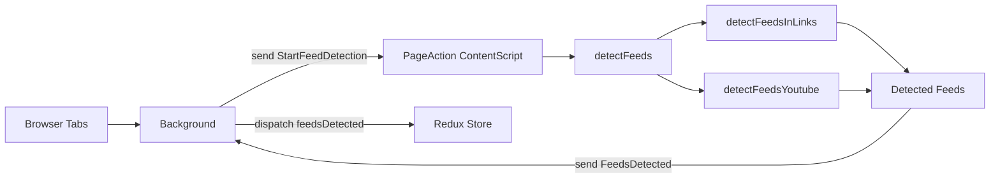

# Feed detection

## Overview

- Detection is triggered by the background script when a tab becomes active or finishes loading. The background script sends a `StartFeedDetection` message to the page.
- The page-action / content-script listens for `StartFeedDetection`, calls `detectFeeds()` and sends a `FeedsDetected` message back to the background.
- The background maps `FeedsDetected` to a Redux action and stores detected feeds.

## Detection flow

The detection logic aggregates results from two detectors:

- `detectFeedsInLinks()` — inspects `link[type]` elements on the page and matches known RSS/Atom MIME types.
- `detectFeedsYoutube()` — special handling for YouTube pages; currently detects playlist feeds via the `list` query parameter and returns a YouTube playlist RSS feed URL.
  

Detected feeds are deduplicated by `href` before being returned to the page-action handler.

## Which feeds are detected

- **Link-based detection** looks for `link[type]` elements whose `type` matches one of the following MIME types:

  - `application/rss+xml`
  - `application/atom+xml`
  - `application/rdf+xml`
  - `application/rss`
  - `application/atom`
  - `application/rdf`
  - `text/rss+xml`
  - `text/atom+xml`
  - `text/rdf+xml`
  - `text/rss`
  - `text/atom`
  - `text/rdf`

- **YouTube playlist feeds**: when the current URL contains a `list` parameter, a feed at `https://www.youtube.com/feeds/videos.xml?playlist_id={list}` is returned. Channel-id detection is present as commented code in the source and can be enabled/extended if needed.