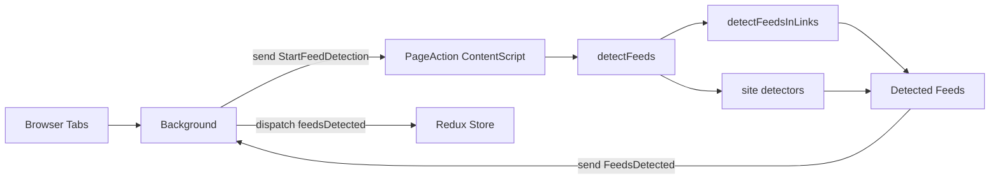

# Feed detection

## Overview

- Detection is triggered by the background script when a tab becomes active or finishes loading. The background script sends a `StartFeedDetection` message to the page.
- The page-action / content-script listens for `StartFeedDetection`, calls `detectFeeds()` and sends a `FeedsDetected` message back to the background.
- The background maps `FeedsDetected` to a Redux action and stores detected feeds.

## Detection flow

`detectFeeds()` aggregates the results of two kinds of detectors:

- `detectFeedsInLinks()` — inspects `link[type]` elements on the page and matches known feed MIME types.
- **site detectors** — construct feed urls from the url of the current page for sites that do not announce (all of) their feeds. Every site detector declares the hostnames it applies to and is registered in `sites/siteDetectors.ts`.

```mermaid
flowchart LR
  BT[Browser Tabs] --> BG[Background]
  BG -->|send StartFeedDetection| CS[PageAction ContentScript]
  CS --> DF[detectFeeds]
  DF --> LNK[detectFeedsInLinks]
  DF --> SITE[site detectors]
  LNK --> DET[Detected Feeds]
  SITE --> DET
  DET -->|send FeedsDetected| BG
  BG -->|dispatch feedsDetected| STORE[Redux Store]
```

Detected feeds are deduplicated by a normalized `href` (lower case host without `www.`, no trailing slash). Feeds announced by the page win over feeds constructed by a site detector.

## Which feeds are detected

### Link-based detection

`link[type]` elements whose `type` matches one of the following MIME types:

- `application/rss+xml`
- `application/atom+xml`
- `application/rdf+xml`
- `application/rss`
- `application/atom`
- `application/rdf`
- `application/feed+json`
- `text/rss+xml`
- `text/atom+xml`
- `text/rdf+xml`
- `text/rss`
- `text/atom`
- `text/rdf`

In addition `application/json` is matched when the link has `rel="alternate"` (json feeds are often announced as plain json).

### Site detectors

| Site | Page | Detected feed(s) |
| --- | --- | --- |
| Reddit | frontpage, `/r/{sub}` (optionally sorted), `/r/{sub}/comments/{id}/…`, `/user/{name}`, `/user/{name}/m/{multi}` | corresponding `.rss` url on the origin of the current page (works for `old.reddit.com` as well) |
| GitHub | `/{user}` | `/{user}.atom` (activity) |
| GitHub | `/{owner}/{repo}` | `releases.atom`, `tags.atom`, `commits.atom` |
| GitHub | `/{owner}/{repo}/commits/{branch}`, `/releases`, `/tags` | feed of the current page only |
| GitLab | `/{user}` | `/{user}.atom` (activity) |
| GitLab | `/{namespace}/{project}` (any page within the project) | project activity atom and tags atom |
| Hacker News | any page | `news.ycombinator.com/rss` (frontpage) |
| Hacker News | `/user?id=…`, `/item?id=…`, `/newest`, `/ask`, `/show` | feeds provided by the third party service `hnrss.org` |
| Stack Exchange (Stack Overflow, Super User, Server Fault, Ask Ubuntu, Stack Apps, all `*.stackexchange.com`, MathOverflow) | `/questions/tagged/{tags}`, `/questions/{id}/…`, any other page | `/feeds/tag/{tags}`, `/feeds/question/{id}`, `/feeds` |
| YouTube | `?list={playlistId}` | playlist feed |
| YouTube | `/channel/{channelId}` and pages that contain the channel id in a `meta[itemprop]` tag (`/watch`, `/@handle`, `/c/…`, `/user/…`) | channel feed |

Reserved paths (e.g. `github.com/settings`, `gitlab.com/explore`) are excluded so that they are not mistaken for user pages.

## Adding a site detector

1. Add a module in `sites/` that exports a `SiteDetector` (`hostnames` + `detect(url)`). `detect` gets the parsed url of the current page and may access the `document` if needed (it runs in the content script).
2. Register it in `sites/siteDetectors.ts`.
3. Add test cases to `__tests__/siteDetectors.test.ts`.
