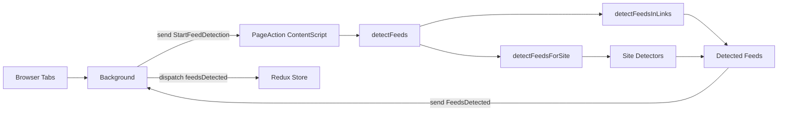

# Feed detection

## Overview

- Detection is triggered by the background script when a tab becomes active or finishes loading. The background script sends a `StartFeedDetection` message to the page.
- The page-action / content-script listens for `StartFeedDetection`, calls `detectFeeds()` and sends a `FeedsDetected` message back to the background.
- The background maps `FeedsDetected` to a Redux action and stores detected feeds.

## Detection flow

Detection aggregates results from two sources:

- `detectFeedsInLinks()` — inspects `link[type]` elements on the page and matches known RSS/Atom MIME types.
- `detectFeedsForSite()` — runs the site detectors in `sites/` against the current page URL.


```mermaid
flowchart LR
  BT[Browser Tabs] --> BG[Background]
  BG -->|send StartFeedDetection| CS[PageAction ContentScript]
  CS --> DF[detectFeeds]
  DF --> LNK[detectFeedsInLinks]
  DF --> DFS[detectFeedsForSite]
  DFS --> SITE[Site Detectors]
  LNK --> DET[Detected Feeds]
  SITE --> DET
  DET -->|send FeedsDetected| BG
  BG -->|dispatch feedsDetected| STORE[Redux Store]
```

Detected feeds are deduplicated before being returned to the page-action handler. Deduplication
runs on a normalized key — lowercase hostname without `www.`, trailing slash removed, **query
string kept** — because distinct feeds often differ only by query.

## Site detectors

Each detector in `sites/` is a pure function from a `URL` to feed candidates. No network access
and no DOM access, which is what makes them unit-testable and lets the Subscribe view reuse them
for pasted URLs:

```ts
export type SiteDetector = {
    hostnames: ReadonlyArray<string>;
    detect: (url: URL) => DetectedFeed[];
};
```

A detector runs when one of its hostnames matches the page hostname, ignoring a leading `www.`
Hosts are matched as a suffix, so `old.reddit.com` and `gist.github.com` reach the `reddit.com`
and `github.com` detectors without being listed individually.

Add a new site by adding a file to `sites/` and listing it in `sites/siteDetectors.ts`.

| Site | Rule |
|---|---|
| GitHub | `/{owner}/{repo}` → `releases.atom`, `tags.atom`, `commits.atom`. `/{user}` → `/{user}.atom`. Section pages narrow to the matching feed. |
| GitLab | Splits the project path at the `-` separator. `{project}.atom`, `{project}/-/issues.atom`, `{project}/-/tags?format=atom`. |
| Hacker News | Frontpage only, at `/rss`. Per-user and per-item feeds would need the third party `hnrss.org`, which this extension deliberately does not depend on. |
| Kickstarter | `/projects/{creator}/{slug}` → `/posts.atom` (project updates). |
| Medium | `@{handle}`, `{handle}`, `{publication}`, `/tag/{tag}`, `/{pub}/tagged/{tag}` → the matching `/feed/…` path. `{handle}.medium.com` → `/feed`. |
| Reddit | Appends `.rss`, preserving the query. Covers subreddits, sorts, single posts, users, multireddits, search and domain listings. |
| Stack Exchange | `/questions/tagged/{tag}` → `/feeds/tag/{tag}`, otherwise `/feeds`. |
| Substack | `{origin}/feed` on any `*.substack.com` host. The path is discarded — `/`, `/about` and `/archive` all resolve to the same feed. |
| YouTube | `list` query parameter → playlist feed. `/channel/{id}` → channel feed. |

Notes on deliberate omissions:

- **GitHub private feeds** (`{user}.private.atom?token=…`) are never synthesized — there is nowhere
  to store the token. A user who pastes one still gets a working feed.
- **Substack custom domains** are not matched. `/feed` is Substack's convention but not a Substack
  marker, so a custom-domain Substack is indistinguishable from any WordPress blog. Those already
  publish `<link rel="alternate" href="/feed">`, which `detectFeedsInLinks()` picks up.
- **Kickstarter** publishes only project updates. There is no creator, category or discovery feed,
  and its pages sit behind bot protection that returns 403, so `link[type]` finds nothing there.

## Which feeds are detected

- **Link-based detection** looks for `link[type]` elements whose `type` matches one of the
  following MIME types:

  - `application/rss+xml`
  - `application/atom+xml`
  - `application/rdf+xml`
  - `application/rss`
  - `application/atom`
  - `application/rdf`
  - `text/rss+xml`
  - `text/atom+xml`
  - `text/rdf+xml`
  - `text/rss`
  - `text/atom`
  - `text/rdf`

## Pasted URLs

`parseUrl()` and `detectFeedsForSite()` are also called from the Subscribe view as the user types.
Submitting the form:

- **one candidate** → subscribes to it, since four of the sites above have a single rule and the
  intent is unambiguous
- **several candidates** → lists them and subscribes to nothing, because picking is the user's call
- **no candidates** → subscribes to the typed URL as before

Candidates also render live while typing, so any suggestion can be added explicitly.

## Rate limiting

Reddit and Stack Exchange rate-limit anonymous requests hard — repeated bursts return HTTP 429,
and Stack Exchange throttles after a handful of requests. A wrong guess returns 404 with an XML
body, which is distinguishable from 429, so candidates can be validated by status code without a
second request.