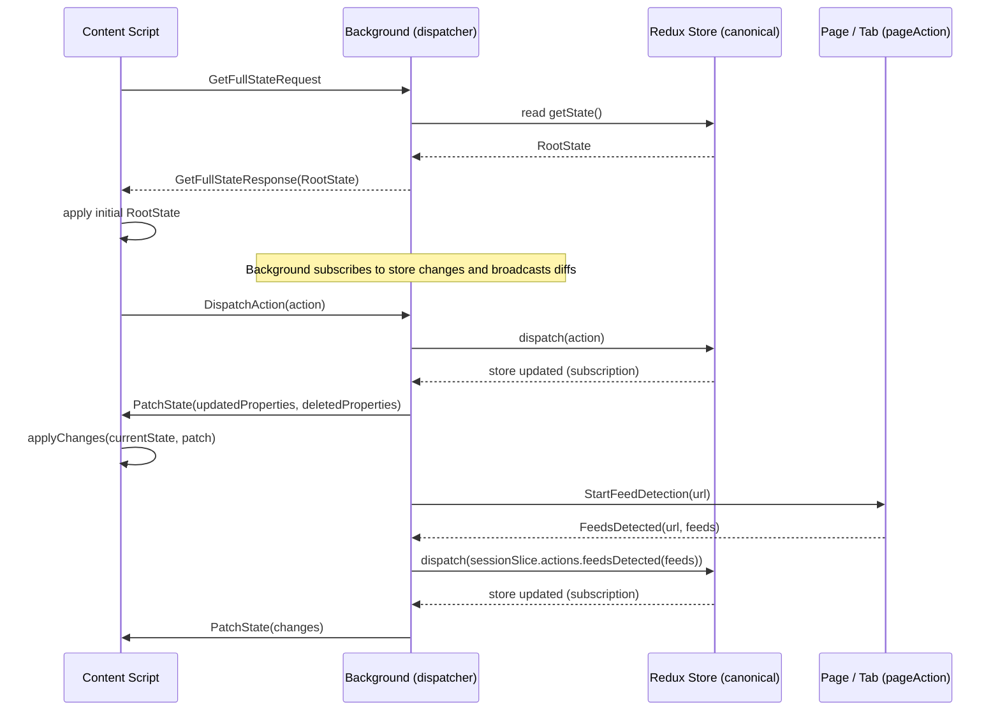

# Redux Bridge (background ↔ content scripts)

## Summary

Provides a messaging bridge that keeps a single canonical Redux store in the background process and mirrors state to content scripts.

Content scripts request the full state on startup and receive incremental shallow patches from the background; they forward user-initiated actions back to the background for authoritative dispatch. This keeps persistent side effects, sagas and I/O centralized while allowing page code to read and react to application state without owning the store.

## Startup & message flow

1. Content script initializes and sends `GetFullStateRequest` (see `messaging.ts`).
2. Background (`wrapStore`) responds with `GetFullStateResponse` containing the full `RootState`.
3. Content script applies the full state as its initial state.
4. Background subscribes to store changes, computes a `shallowDiff`, and broadcasts `PatchState` messages with `updatedProperties` and `deletedProperties`.
5. Content scripts apply `PatchState` with `applyChanges(oldState, changes)` (see `changeUtils.ts`).

## Implementation notes

- The diff is shallow at the root level; if a nested object changes its full new value is sent as an updated property (not a deep merge).
- During background init incoming messages are buffered and later replayed into `wrapStore` (see `background.ts` for `messageBuffer` usage).
- `browser.runtime.sendMessage(...)` is promise-based — producers should handle rejections. The background treats the usual "Could not establish connection. Receiving end does not exist." error as transient and sometimes retries (see `background.ts`).

## Extending the bridge
When adding new message types:

1. Add the new enum entry to `MessageType` in `messaging.ts` and adjust `sendMessage`.
2. Handle the incoming message in `wrapStore` (or other background handler).
3. Implement the content script side: send the new message type and handle responses/side-effects.

## Troubleshooting

- If proxies do not receive messages: check that the content script is injected and listening; background retries are limited.
- If state appears inconsistent: confirm the content script requested the initial full state (`GetFullStateRequest`) and applied the full response prior to consuming patches.

